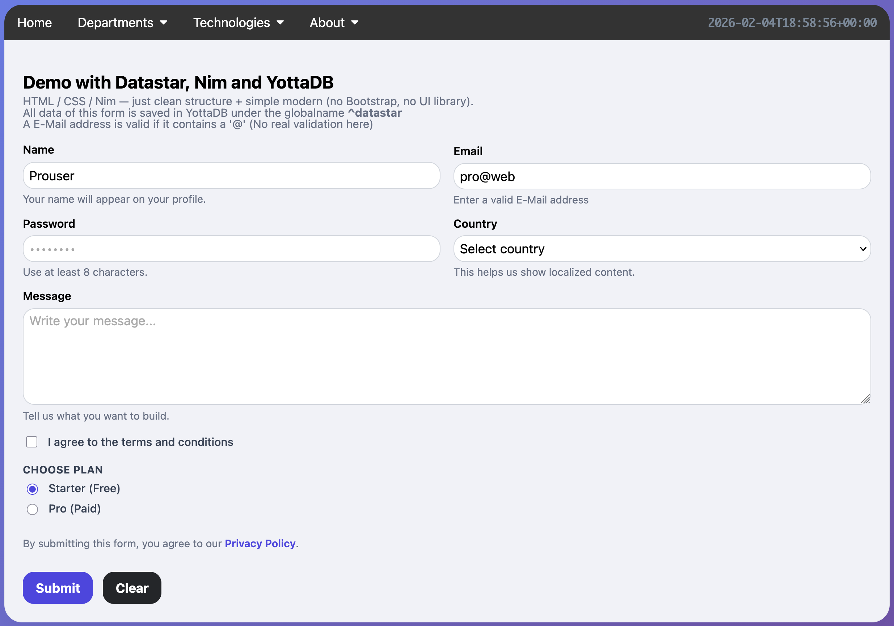
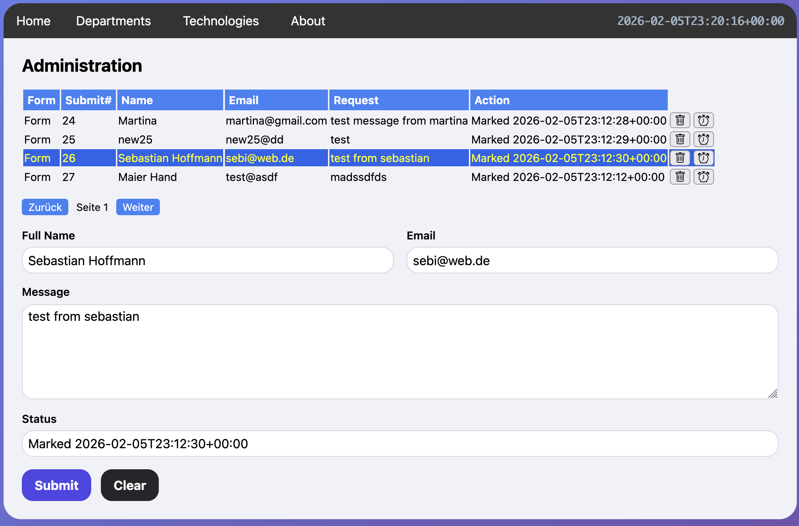

# Nim - YottaDB Samples

This repository contains sample applications for the [nim-yottadb](https://github.com/ljoeckel/nim-yottadb) library. 
It demonstrates how to leverage [Nim's](https://nim-lang.org) performance to interact seamlessly with the [YottaDB](https://yottadb.com) NoSQL database.

## 🚀 Key Features
* **High-Performance Database Access:** Direct manipulation of globals, local variables, and transactions from Nim.
* **Modern Web Integration:** Features examples using [Datastar](https://data-star.dev) for building reactive UIs without heavy JavaScript.
* **Hypermedia-Driven:** Support for `text/html` and Server-Sent Events (SSE) for real-time backend-to-frontend updates.

## 🛠 Prerequisites
Ensure you have YottaDB and Nim installed. For detailed setup instructions, please refer to the main repository:
👉 [Installation Guide for YottaDB & Nim](https://github.com)

---

## 📂 Sample: src/datastar (Contact Manager)

A lightweight web application demonstrating how to capture, validate, and persist form data directly into YottaDB.




### Technical Highlights
* **Pure Backend Logic:** All validation, persistence, and UI updates are handled strictly on the server side.
* **Real-time Feedback:** Uses Server-Sent Events (SSE) to stream updates instantly to the browser.
* **Efficient Web Server:** Powered by Nim’s native `asyncHttpServer` for high concurrency.


### 🚀 Quick Start

Launch the server directly using [Nimble](https://github.com):

| Mode | Command | Description |
| :--- | :--- | :--- |
| **Standard** | `nimble form` | Updates the database (non-transactional). |
| **Transactional** | `nimble formtx` | Atomic update via YottaDB transaction. |

---

### 🔄 Transaction Logic

When using transactions, data must be passed from the main thread to the transaction thread using YottaDB variables (e.g., `context`). This ensures thread safety and data consistency within the [YottaDB Transaction](https://yottadb.com) lifecycle.

```nim
# 1. Map data to the YottaDB context variable
for key in signals.keys:
    setvar: context(key) = $signals[key]

# 2. Execute the atomic transaction block
let rc = Transaction:
    let id = increment ^datastar("submits")
    for (key, value) in queryItr context.kv:
        setvar: ^datastar(id, key) = value
