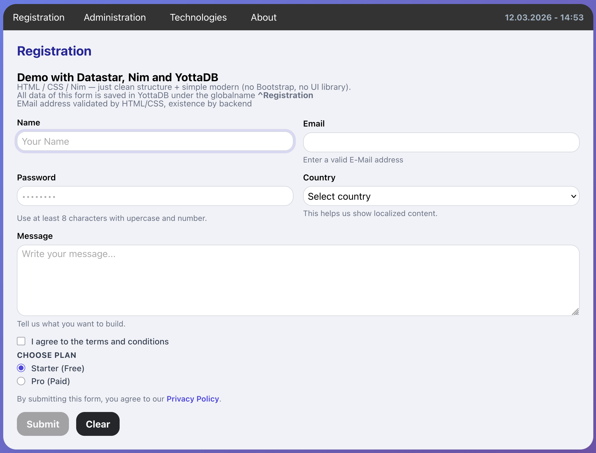
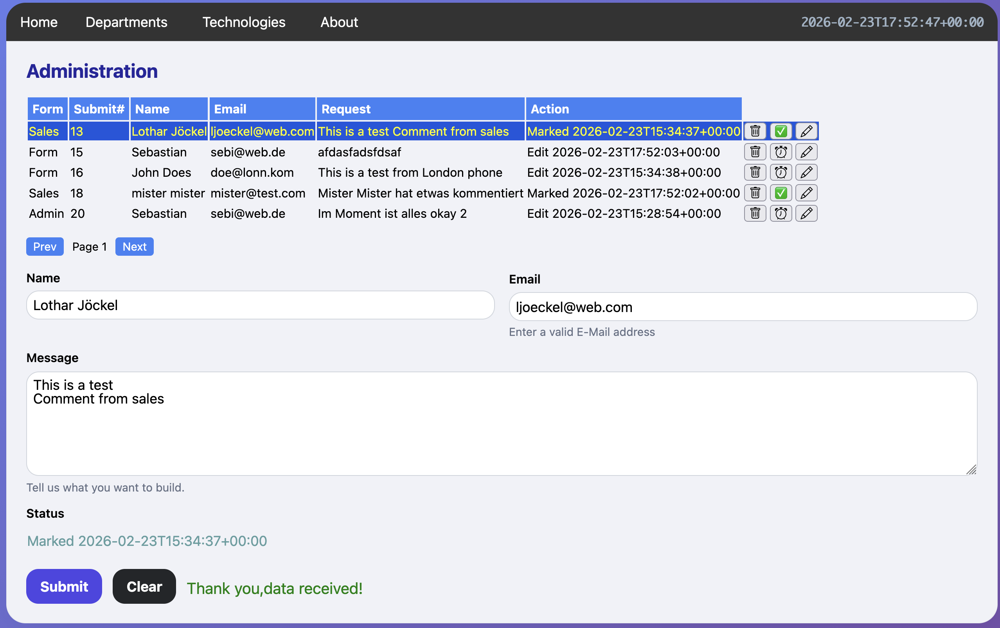
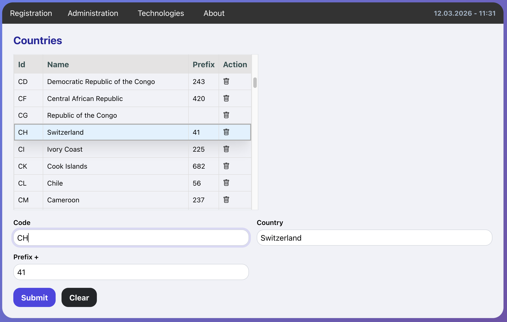

# Nim - YottaDB Samples

This repository contains sample applications for the [nim-yottadb](https://github.com/ljoeckel/nim-yottadb) library. 
It demonstrates how to leverage [Nim's](https://nim-lang.org) performance to interact seamlessly with the [YottaDB](https://yottadb.com) NoSQL database.

## 🚀 Key Features
* **High-Performance Database Access:** Direct manipulation of globals, local variables, and transactions from Nim.
* **Modern Web Integration:** Features examples using [Datastar](https://data-star.dev) for building reactive UIs without heavy JavaScript.
* **Hypermedia-Driven:** Support for `text/html` and Server-Sent Events (SSE) for real-time backend-to-frontend updates.

## 🛠 Prerequisites
Ensure you have YottaDB and Nim installed. For detailed setup instructions, please refer to the main repository:
👉 [Installation Guide for YottaDB & Nim](https://github.com)

---

## 📂 Sample: src/datastar (Registration Manager)

A lightweight web application demonstrating how to capture, validate, and persist form data directly into YottaDB.

### Technical Highlights
* **Pure Backend Logic:** All validation, persistence, and UI updates are handled strictly on the server side.
* **Real-time Feedback:** Uses Server-Sent Events (SSE) to stream updates instantly to the browser.
* **Efficient Web Server:** Powered by mummyDS multi-threaded HTTP server with Datastar extensions for high concurrency.